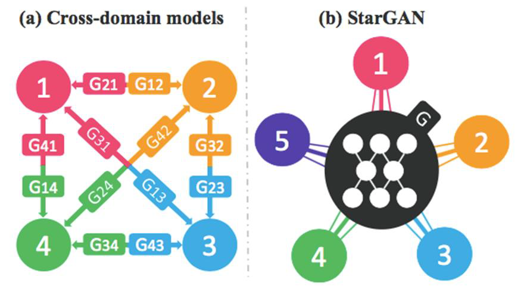
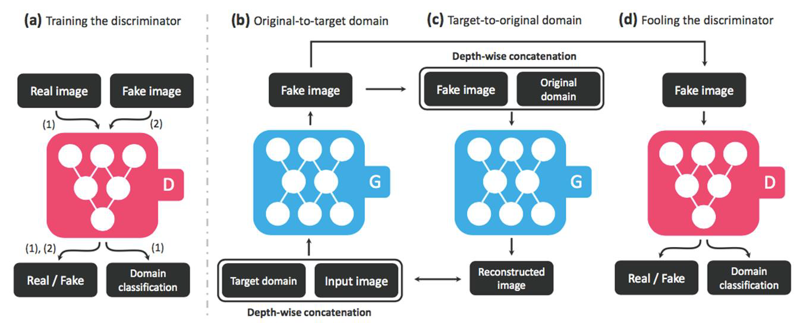
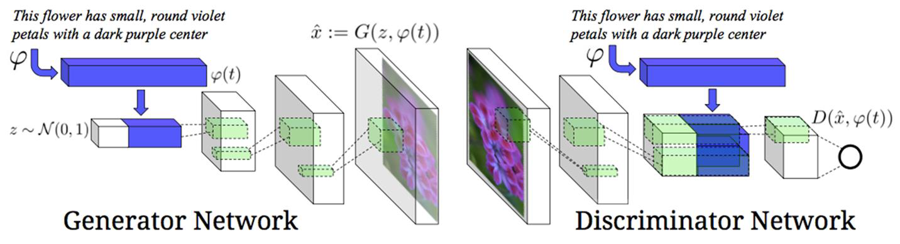

# 生成对抗网络 / Generative Adversarial Network

## 对抗生成网络原理

$$
\min \limits_{G} \max \limits_{D} V(D,G)=E_{x\sim P_{data}(x)}[logD(x)] +  E_{z\sim P_z(z)}[Log(1-D(G(z)))]
$$
==？？？？？？？？？？？？？？？？？？？？？？？？？？？？？？？？？？？？？？？？？？==

* $D(x)$为一个概率([0,1])，为0时为假的图像，为1时为一个真实图像
* $\max D(x)$ ==>  $logD(x)$ 趋近于1，$logD(x)$ 增大， $D(x)$ 也增大
* 同样后半式将变小

## 深度卷积对抗生成网络(DCGAN)

### 如何构建一个新的GAN网络

#### 目标：从随机向量生成真实图像

* 定义G的输入输出
* 定义D的输入输出
* 定义G和D的结构

#### 生成器G

* 输入一个向量，输出一个图像（64x64x3）
* 先对向量做全连接，再将全连接的结果做reshape，修改为（4x4x1024）看做一个feature map（Project and reshape）

* 对feature map 做反卷积，每次的步长（stride）为2，使得每次反卷积结果长宽加倍， kernel 数减半。连续做三次，得到（32x32x128）
* 再做一次反卷积得到图片         ==这reshape了吗？   kernel不再是减半了==

##### 反卷积

输入：

| $A_{00}$     | $A_{01}$     | $A_{02}$     | $A_{03}$     |
| ------------ | ------------ | ------------ | ------------ |
| **$A_{10}$** | **$A_{11}$** | **$A_{12}$** | **$A_{13}$** |
| **$A_{20}$** | **$A_{21}$** | **$A_{22}$** | **$A_{23}$** |
| **$A_{30}$** | **$A_{31}$** | **$A_{32}$** | **$A_{33}$** |

卷积核参数：

| w(0,0)     | w(0,1)     | w(0,2)     |
| ---------- | ---------- | ---------- |
| **w(1,0)** | **w(1,1)** | **w(1,2)** |
| **w(2,0)** | **w(2,1)** | **w(2,2)** |

$$
B00 = A_{00}*w(0,0) + A_{01}*w(0,1) + A_{02}*w(0,2) + A_{10}*w(1,0) + \\
A_{11}*w(1,1)+A_{12}*w(1,2)+A_{20}*w(2,0) + A_{21}*w(2,1) + A_{22}*w(2,2)
$$

矩阵操作：
$$
X = [A_{00},A_{01},A_{02},A_{03},A_{10},A_{11},A_{12},A_{13},A_{20},A_{21},A_{22},A_{23},A_{30},A_{31},A_{32},A_{33}]\\
w=
$$

* 卷积操作 ：$Y = CX $   ==>  X 是(16,1)的矩阵, C是(4,16)的矩阵
* 反卷积操作： $Y = C^TX$  ==>  X是(4,1)的矩阵, CT是(16,4)的矩阵

### 特点：

* Pooling层用convolutional层替代
* 输入层G和输出层D都使用batch normalization
* 生成器G上除了输出层使用tanh外其他都用Relu
* 判别器D上使用LeakyReLU

## 图像翻译(Pix2Pix)

目标：以输入图为条件，生成内容相似但风格不同的新图

* Pix2Pix 要求图像必须成对

将Encoder-decoder模型转变为U-Net，使中间的每一层都连接起来

Encoder-decoder模型

U-Net

### 训练生成器G==？==

### 训练判别器D ==？==

## 无配对图像翻译 CycleGAN

目标：从无配对的图像中学到风格的变换

* 建模：（使用了两个生成器和两个判别器）
  * 两个领域x, y
  * 映射G: x->y
  * 映射F: y->x
  * 判别器Dx: 区分x和F(y)
  * 判别器Dy: 区分y和G(x)

* 转换过去再转换回来，两个图片不变

## 多领域图像翻译(StarGAN)

* 之前的模型，训练好的一种模型只能解决一类问题，StarGAN可以解决多领域的问题

#### StatGAN

* 将生成图像和真实图像输入D，得到判断是否是真实和分类

* 将目标领域和当前的input输入到G中，得到生成图像
* 也可以将生成图像与original domain 输入到G，得到重建后的图像，再和原图像做重建损失

## 文本生成图像(ext2Img

* 生成真实的与文字匹配的图像

* z在生成器部分，将文本编码，加上一个随机向量 $\vec{z}$ （调节不同输出）
* 然后像DCGAN一样做反卷积生成图像
* 将输出图像输入到判别器，判断图像是否真实，判断图像是否与文字匹配

生成器G：

* 输入：随机向量+文本编码
* 输出：图像

判别器D：

* 输入：生成图像+文本编码
* 输出：图像文本是否匹配+图像是否真实

